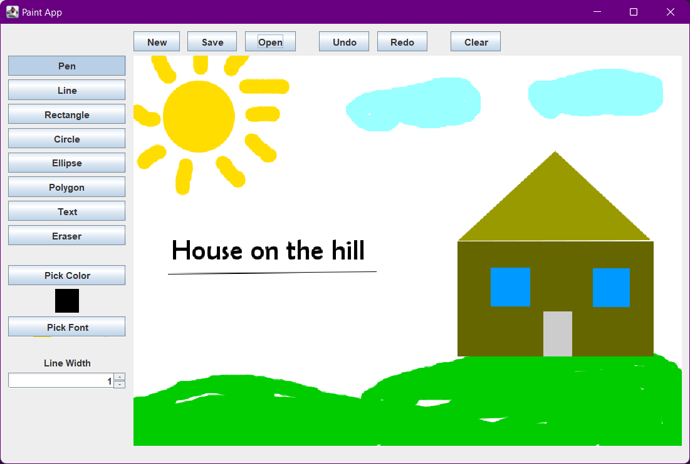

# Java Paint

**Java Paint** is a simple drawing application in Java using Swing and AWT libraries as a part of semester project for
Java Programming class.

- Author: Martin Čorovčák
- Module: com.corovcak.martin.java.paint
- License: MIT
- Language: Java
- Version: 1.0
- Libraries: 
  - Swing
  - AWT
  - org.drjekyll.fontchooser (FontDialog class)

## Installation & Build
1. Clone the repository.
2. The GUI has been created using GUIDesigner utility inside JetBrains IntelliJ IDEA IDE. If you want to use the 
    GUIDesigner to edit GUI, then you must use this IDE.
3. Install dependencies using Maven install script.
4. Build & run the GUI application.

## Main GUI
The GUI contains buttons and settings panels with the most important part being the white Canvas frame in the middle.
Each button or spinner has different functionality attached to it.
  - *Pen*, *Line*, *Rectangle*, *Circle*, *Ellipse*, *Polygon*, *Text*, *Eraser* are Toggle buttons, meaning you can
  have only one selected at a time
    - *Pen*
      - A free-hand line drawing tool.
      - User presses left-mouse (or any button) on the Canvas and drags it along the Canvas to create custom free-hand
        lines.
      - Default Tool selected from the start.
    - *Line*
      - Draws a straight between 2 points selected.
      - User presses left-mouse (or any button) on the Canvas and drags it along the Canvas to create a line starting
        from the first clicked position and ending at the position when the user releases the button.
      - User is shown a previewed line during the dragging event.
    - *Rectangle*
      - Creates a rectangle between 2 points on the Canvas.
      - User presses left-mouse (or any button) on the Canvas and drags it along the Canvas to create a rectangle 
        starting from the first clicked position and ending at the position when the user releases the button.
      - User is shown a previewed rectangle during the dragging event.
    - *Circle*
      - Creates a circle (an ellipse bounded by a square bounding box) on the Canvas.
      - User presses left-mouse (or any button) on the Canvas and drags it along the Canvas to create a circle
        starting from the first clicked position and ending at the position when the user releases the button.
      - User is shown a previewed circle during the dragging event.
      - A circle is created inside an imaginary square, which is a minimum bounding rectangle of the circle.
    - *Ellipse*
      - Creates an ellipse between 2 points on the Canvas.
      - User presses left-mouse (or any button) on the Canvas and drags it along the Canvas to create an ellipse
        starting from the first clicked position and ending at the position when the user releases the button.
      - User is shown a previewed ellipse during the dragging event.
      - An ellipse is created inside an imaginary rectangle, which is a minimum bounding rectangle of the ellipse.
    - *Polygon*
      - Creates a polygon between specified points on the Canvas.
      - User presses left-mouse on the Canvas to create a Polygon corner points on the Canvas.
        - User is shown previewed points as small circles on the Canvas.
      - When the user added all desired Polygon points, then he can press right-mouse button to connect all points
        and create a filled polygon bounded by them.
      - When the user wishes to end the Polygon creation process, then he can press middle-mouse button to end it and
        remove all already created polygon points.
    - *Text*
      - Creates a custom Text (specified in a dialog) using selected point on the Canvas.
      - User presses left-mouse button on the Canvas where he desires to place the specified text.
      - An input dialog window is shown for the user to type the desired text and hit Confirm.
      - After confirmation, the text is shown on the Canvas using the specified point as a reference location.
    - *Eraser*
      - just like *Pen*, user presses left-mouse (or any button) on the Canvas and drags it along the Canvas to create 
        custom free-hand lines of White color.
      - If user changes color during this mode, *Pen* tool is automatically selected.
  - *Pick Color* button
    - opens a Swing Dialog window for the user to choose a desired Line/Text color.
  - *Pick Font* button
    - Opens a FontDialog from an external library (installed as a dependency).
    - User chooses desired Font family, Font size, Font decoration and style and hits OK.
  - *Line Width* spinner
    - A settings component that allows user to "spin"/select line width (sstroke) for Pen/Line/Eraser tools
    - Default is 1 and allows setting only positive integers.
  - *New* button
    - Clears the Canvas and Undo/Redo stacks to create a blank Canvas to draw
  - *Save* button
    - Saves the current image drawn on the Canvas to specified file.
    - Opens a SaveFileDialog for user to choose desired file name and location.
    - Defaults to Image Formats such as .jpg and .png.
  - *Open* button
    - Opens a specified image file and draws it on the Canvas as a "background".
    - OpenFileDialog window is presented for the user to choose desired file location.
    - Hitting Clear, Undo or Redo doesn't remove the background image from the Canvas - hitting *New* button does.
  - *Undo* button
    - Undo-s previously created shape/text and redraws previous image (with the shape/text gone).
    - Undo operation is by default infinite in the amount of performed events, meaning you can have millions of shapes
      drawn and all of them can be "undo-ed".
  - *Redo* button
    - Redo-s previously undo-ed shape/text and redraws undo-ed image (with the shape/text undo-ed present).
    - Redo operation is by default infinite in the amount of performed undo-s/events, meaning you can have millions of 
      shapes drawn and all of them can be "redo-ed".
  - *Clear* button
    - Clears/Repaints the whole Canvas with either White color if not background was specified, or with background
      otherwise.
    - All shapes/texts drawn on the Canvas will be removed (but can be reverted back using Undo operation).

The Canvas window has predefined static size of 700x600 pixels. Can be changed in code, if desired.

#### Enjoy your artistic endeavours!